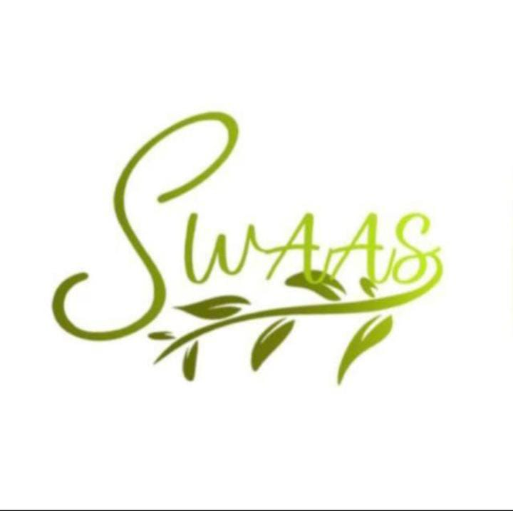

<!-- Replace "banner-image-url" with the actual URL of your banner image -->

# 🌍 Swaas - The EcoTech Society of GTBIT

Welcome to **Swaas - The EcoTech Society of GTBIT**! We are a community of students passionate about combining environmental awareness with technological innovation to create sustainable solutions. 

Our society is dedicated to promoting eco-friendly practices, raising awareness about environmental issues, and empowering students to contribute towards a greener future through technology.

---

## 🌱 Our Vision

- **Eco-Consciousness**: Foster an eco-conscious culture among students and the community.
- **Tech for Good**: Use technology as a tool to create impactful, sustainable solutions.
- **Collaboration and Growth**: Connect like-minded individuals and organizations, and promote skill-building through projects and events.

## 🌐 Key Initiatives

### ♻️ EcoTech Projects
We work on projects that leverage technology to tackle environmental challenges, from waste management solutions to renewable energy innovations.

### 📢 Awareness Campaigns
Organizing seminars, workshops, and social media campaigns to spread awareness about climate change, sustainable development, and eco-friendly practices.

### 🤝 Community Engagement
Collaborating with other student organizations, local NGOs, and companies to extend our impact beyond the campus.

---

## 📬 Get in Touch

Interested in collaborating with us or learning more about our work? Feel free to reach out!

- **Email**: swaas.gtbit@gmail.com
- **GitHub**: [Swaas EcoTech Society GitHub](https://github.com/Swaas-EcoTech)
- **Instagram**: [Swaas](https://www.instagram.com/swaas.gtbit/)
- **LinkedIn**: [Swaas-GTBIT](https://www.linkedin.com/company/swaas-gtbit/)
- **Twitter**: [Swaas_GTBIT](https://x.com/Swaas_Gtbit/)

---

✨ Together, let's innovate for a greener planet! ✨

